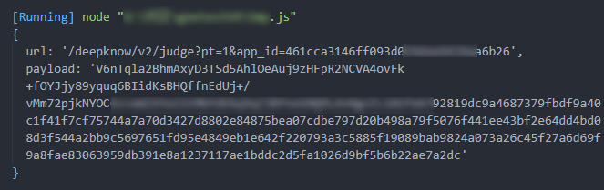

# geetestV4-crack

极验geetest|4代无感|js逆向
仅使用`app_id`参数生成`请求url`和`请求payload`。

## 环境

安装 Node 环境

## 示例

- 获取`url`、`payload`:`node "geetestV4-sense.js"`
`

- 请求方法: `post`

- 请求成功：`{"gen_time":xxx,"message":"ok","session_id":"xxx","status":1,"ttl":1800}`

## 声明

本项目仅供学习交流使用，请勿用于非法用途！